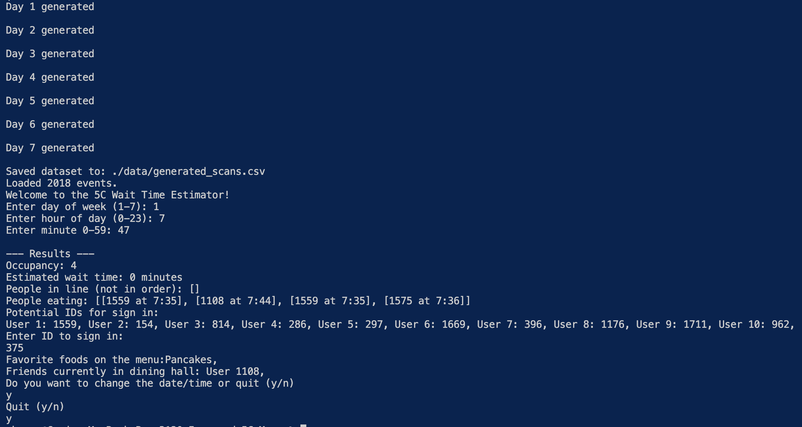
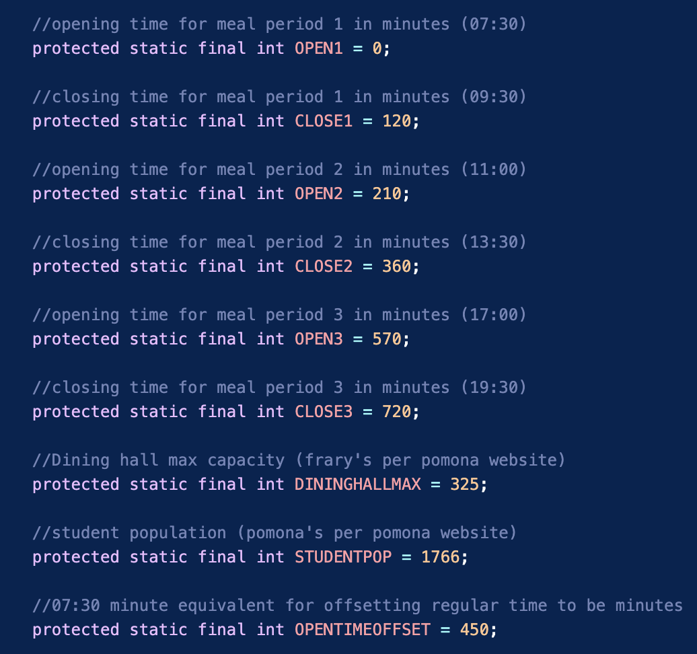
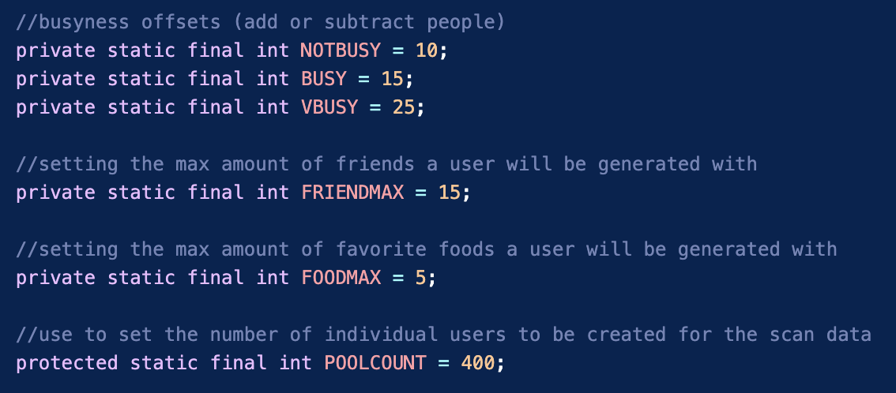

# Improved-5C-Menu
## Overview
At the 5C's we are incredibly fortunate to be cursed with choice. From a selection of seven very stomachable dining halls, other factors often come into play other than the simple "I'm hungry". No matter what reason, all too often are students faced with a packed dining hall—completely taken by surprise. We wanted to develop a solution to this problem!

The Improved 5C Menu is a small scale (but scalable!) look into what a 5C menu app with greater functionality could look like. In our implementation we focus on four (incredibly useful) features. 

*Wait Time Estimate*: Estimates the wait time in line for food (assuming only one line for our scale)

*Occupancy*: Estimates the occupancy of the dining hall 

*Friend Location*: Lists (estimated) friends who currently occupy the dining hall

*Favorite Food*: Lists a user's favorite food(s) that are currently on the menu for that meal period

For our scale (and because we were unable to access live dining hall scan data) we decided to make our program a simulation of these features. Thus, per run of the main, we simulate a week's worth of scan data and give sample outputs for any user that was generated!

#### Sample Output:

As seen in the output, the data generation is confirmed, then the **welcome message** is outputed. 

If *n* was inputted in the "Do you want to change..." then another user ID could be inputed at that same time and date.

if *n* was inputted in the "Quit" then the date/time could be changed, and the program would continue to run on that generated data set

## Running the code
The progam is run through Main.java through command line arguments. Upon running the code, the data will confirm generation before entering the main user loop.

For the *day*, input 1-7 with **Monday** being 1 and **Sunday** being 7 

For the *hour*, input 0-23 (24 Hr time).

For the *minute*, input 0-59.

This will then output the people in line, the dining hall occupants, wait time, and total occupancy. 

10 users will then be shown as potential inputs to 'sign-in' as. These do not need to be followed. Any number could be inputted, but it is not guarenteed the ID exists.

The User information will be inputed as if they were signing in at that particular time into the app/program. 

Two exit prompts will follow. Answering "y" to both will quit the program entirely. Answer "n" to the first will allow for more user sign-ins at that time. Answer "n" to the second and the date and time can be changed (within that week of generated data). 


## Making alterations to the Data Generation
The engine under the app and the calcuations is within the file SimulationEngine.java. Partnered with SystemManager.java, the simulation parameters can be changed at will. 

**ID** creation is based off of the *student population* with IDs being selected from 1 -> max population

#### Alterations in SystemManager.java
==These times **MUST** be inputted as minutes with 0 being the opening time== 
==If the times are altered, the **OPENTIMEOFFSET** must also be corrected==


#### Alterations in SimulationEngine.java
==The busyness offsets can be used to correct unusual flow in the data set==
* We assume the first ~30 minutes of the meal period is less busy 
    * NOTBUSY offset used
* Middle most busy
    * VBUSY offset used
* Last ~30 minutes is slightly busy
    * BUSY offset used

*Offsets are randomly subtracted or added to a base flow => maximum occupany / minutes of operation*


## Data Format

##### Scan Data
Scan data (with our generation) is formatted by day, hour, minute, user ID. Each line is a different scan

##### Menu
Menu data (manual creation) is formatted day, meal period, item. Each line is a different menu item

The menu was generated from ChatGPT with the formatting given as parameterization. 

## Public Method Documention 

#### DiningHall.java
```java
public DiningHall()
```
* Zero parameter constructure, initalizes events and dayToEvent instance variables with an empty ArrayList and Map respectively. 

```java
public void loadData(String filename)
```
* Takes file path of scan data to populate DiningHall object

```java
public ArrayList<ScanEvent> getDayEvents(int day)
```
* Returns ArrayList of all ScanEvents on a particular day

```java
public int timeSpent(int mealPeriod)
```
* Returns a random occupy time (in the dining hall) in minutes
* Uses data obtained from survey of average stay times per meal period: 
    * Breakfast Average: 28.84, Standard Deviation: 26.86
    * Lunch Average: 38.92, Standard Deviation: 12.39
    * Dinner Average: 48.09, Standard Deviation: 15.71

```java
public int[] getOccupancy(int day, int hour, int minute)
```
* Returns a length 3 integer array
    * with the format [Line size, Number of people eating, Wait time]

```java
public PriorityQueue<ScanEvent> getPQ()
```
* Returns the Priority Queue used for occupancy

```java 
public Queue<ScanEvent> getQ()
```
* Returns the Queue used for in line people

#### MenuParser.java
```java
public MenuParser(String menusamplefilename)
```

* Creates MenuParser Object with an input of the menu file path (CSV) that parses the CSV into an ArrayList of each row, and also one of all food items

```java
public ArrayList<String> getAllFoodItems()
```

* Returns all the food item names contained in the file

```java
public ArrayList<String> getItemsForDay(int whatdayisit,int whatnomealisit)
```

* Takes input of day and meal period number to return the list of item names in that meal period

#### ScanEvent.java
```java
public ScanEvent (int d, int h, int m, int u)
```
* Constructor takes day, hour, minute, and user ID as input.
* Populates instance variables with the above information, and calculates an *enteringTime* to be used in the wait time and occupancy calculations

```java
public int getDay()
```

* Returns what day (1-7)

```java
public int getTime()
```

* Returns the time (in minutes) the event occured

```java
public int getUserId()
```

* Returns the user ID of the scan event (who scanned in)

```java
public String toString()
```

* Returns a string representation of the Scan

#### SimulationEngine.java
```java
public SimulationEngine()
```
* Zero parameter constructor intializes instance variables with empty data structures

```java
public void intializeUsers(String menu)
```
* Generates user pool, friends, and favorite foods to grab from for simulated scans
* Parameter menu is the string filepath of the file to be read

```java
public void generateData()
```

* Generates a week worth of scan data for each day and meal period, writes to a (specified) CSV for use

```java
public int mealPeriod(int time)
```

* Determines meal period (returns -1 if out of a meal period)
* Time input in minutes
* Returns integer that specifies the meal period

```java
public Map<Integer, ArrayList<ScanEvent>> getAllScanData()
```

* Returns maps of all simulated data

```java
public void saveToCSV(String filename)
```

* Writes all scan data to a CSV
* Parameter filename is the CSV to write to

#### SystemManager.java

```java
public SystemManager()
```

* Zero parameter constructor creates a new DiningHall object

```java
public void loadScanData(String filename)
```

* Loads scan data into dining hall object

```java
public void runSimulation(int day, int hour, int minute)
```

* Runs the Occupancy calculations and updates occupancyInfo

```java
public DiningHall getDiningHall()
```

* Returns the dining hall object in use

```java
public int getOccupancy(int day, int hour, int minute)
```

* Returns integer of occupants

```java
public int getWaitTime(int day, int hour, int minute)
```

* Returns integer of wait time

```java
public String peopleInLine()
```

* Returns String of all people currently in the line

```java
public String peopleEating()
```

* Returns String of all people currently occupying (eating in) the dining hall

#### User.java

```java
public User(int id)
```

* Constructor that only specifies id
* Creates blank user other than ID

```java
public User(int id, ArrayList<Integer> friends, ArrayList<String> foods)
```

* Secondary constructor (mostly for testing)
* Intializes all values with inputs

```java
public int getId()
```

* Returns ID number of user

```java
public ArrayList<Integer> getFriends()
```

* Returns ArrayList of friend Integer IDs

```java
public ArrayList<String> getFoods()
```

* Returns ArrayList of favorite food strings

```java
public void addFavFood(String food)
```

* Adds favorite food to user
* Parameter food is the string of the food to be added

```java
public void addFriend(int id)
```

* Adds new friend integer id to list
* Parameter id is the integer to be added

```java
public int hashCode()
```

* Hashes objects based on ID number
* Returns integer for hashing

```java
public boolean equals(Object o)
```

* Returns boolean if the object is equal to the user
* equality determined based on user ID

```java
public String toString()
``` 

* String representation of a User object
